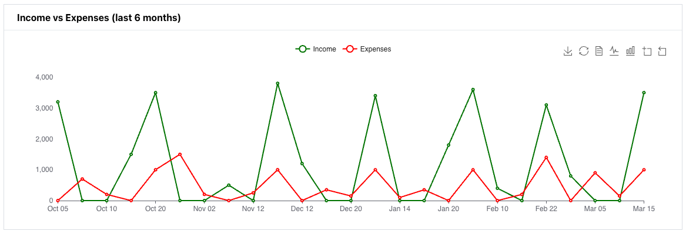
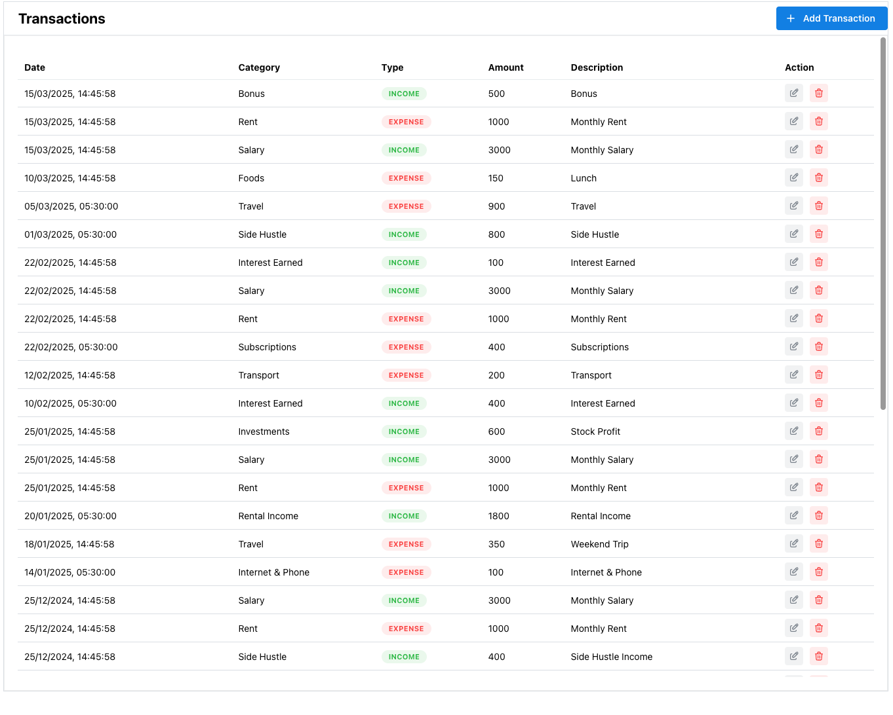

### Features Implemented

1. **Stat Card Summary:** Displays key financial metrics like total income, total expenses, and net worth with percentage changes compared to the previous month.

   

2. **Income vs Expenses Chart:** Interactive line chart showing trends for income and expenses over the last 6 months.

   - **Download:** Export the chart as an image.
   - **Refresh:** Reload chart data.
   - **Switch View:** Toggle between line chart and bar chart.
   - **Zoom/Reset:** Zoom in, zoom out, and reset chart view.

   

3. **Category-wise Expenses:** Pie chart providing a visual breakdown of expenses by category.

   

4. **User Profile Update:** Allows users to update their profile details (name, email, etc.).

   
   

5. **Navigation:** Side menu enabling quick access to dashboard, transactions, and other sections.

   

# Transaction Management

## Overview

The Transaction Management feature allows users to efficiently manage their financial transactions by adding, editing, and deleting records. It provides a clean and user-friendly interface to track income and expenses with categorized details.

## Features Implemented

1. **Transaction Table:**  
   Displays a list of all transactions, including date, category, type (income or expense), amount, and description. Users can easily view and manage all transactions in one place.  
   

2. **Add Transaction:**  
   A button to add new transactions. Clicking it opens a form where users can input transaction details like date, type (income or expense), category, amount, and description.  
   

3. **Edit and Delete Transaction:**  
   Allows inline editing and Deleting of existing transactions directly in the table. Clicking the edit button enables editing mode for quick updates.  
   

# **Asset and Liability Management**

## **Features Implemented**

1. **Asset and Liability Table:**  
   Displays a list of assets and liabilities with key details like name, value, type (Asset or Liability), and category.  
   Users can easily track and manage their financial data.

   

2. **Add Asset/Liability:**  
   A button to open a modal form where users can add a new asset or liability by filling in details like name, value, type, and category.

   

3. **Inline Edit and Delete:**

   - **Edit:** Users can modify asset or liability details directly from the table using the edit button.
   - **Delete:** Users can delete an asset or liability using the delete button in the table.

   

## **Setup**

### **Prerequisites**

Prerequisites
Ensure you have the correct versions of Node.js and npm installed:

bash
Copy
Edit

Check Node.js version

node -v

Output: v22.14.0 or near 20.x

Check npm version

npm -v

Output: 11.2.0 or near 10.x

Setup

1. Create .env.local File
   Create a .env.local file in the root directory and add the following values:

NEXT_PUBLIC_SUPABASE_URL = i-have-given-this-separately
NEXT_PUBLIC_API_BASE_URL= i-have-given-this-separately
NEXT_PUBLIC_SUPABASE_ANON_KEY = i-have-given-this-separately

2. Install Dependencies
   Install project dependencies using yarn or npm:

Using yarn

yarn install

OR using npm

npm install

3. Start Development Server
   Start the development server with:

npm run dev
